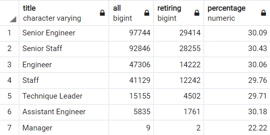
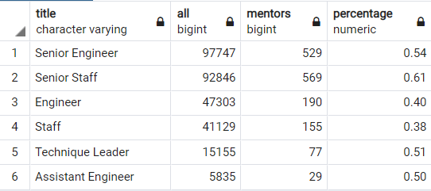
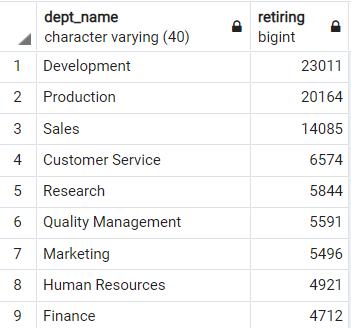
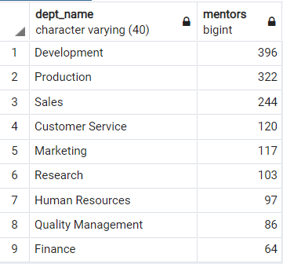

# Pewlett Hackard Analysis

## Overview
The objective of this analysis is to determine the number of retiring employees per title, and identify employees who are eligible to participate in a mentorship program.

## Results
|Employees Summary|
|-|
 

From the retirement table, we can observe the following:
* About 30% in each title is retiring.
* 63.8% of all retiring employees correspond to a Senior title.

|Mentors Summary|
|-|

From the Mentors table we can see that:
* 70.88% of the total mentors have a Senior position.
* In average, only 0.49% of all employees are mentors

## Summary
* As seen from the retirement results, there is a total of 90,398 employees retiring from various positins. This does not mean that all of them should be filled. Since 30.04% of all the employees, excluding management (28.92% incuding management, but it is an outlier according to the IQR criteria), are retiring, it is a good opportunity to think about restructuring the company. This could lead to a big reduction in the amount of employees needed to be hired.
* When analysing the amount of qualified, retirement-ready employees in the departments to mentor the next generation of Pewlett Hackard employees, we see that only 1549 (0.49%) of all employees fulfill the mentor conditions. Assuming that all positions need to be filled, the mentor to new employee ratio would be 1 to 58.36, this is like an undergraduate studies teacher to student ratio. Unless this mentors' job becomes a full time mentoring, or the positions to be filled have a very simple job, there is no way this company will be able to train it's new employees correctly.
* Two additional tables that could help understand the "Silver Tsunami" are a retirementand mentors by department summary like the ones shown below.

|Retirement by Department  |Mentors by Department|
:-------------------------:|:-------------------------:
 | 